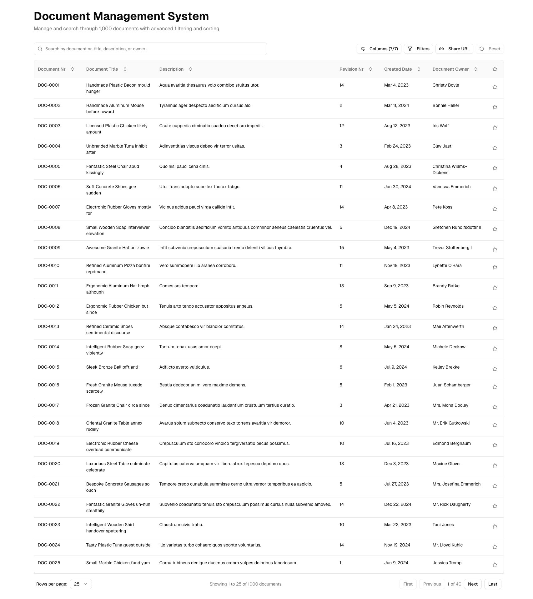
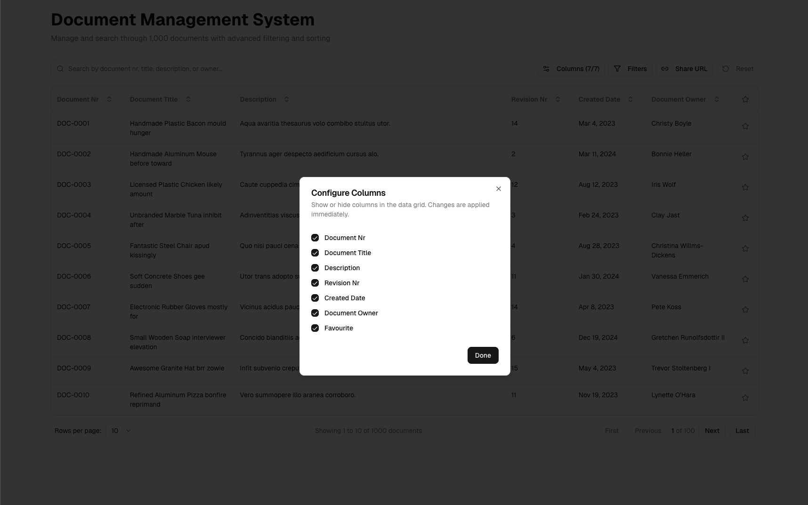
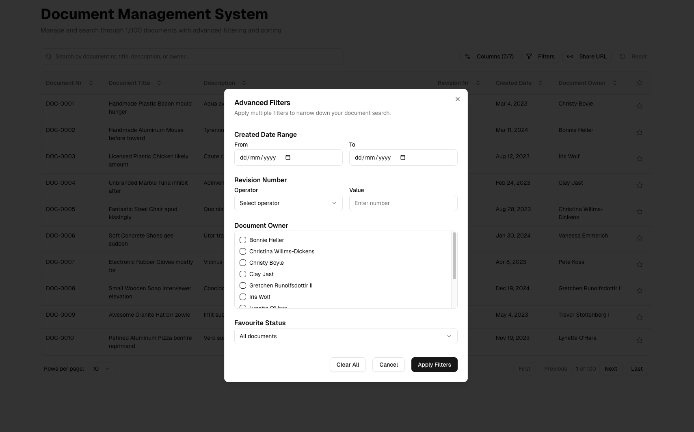

# Demo Documentation

## Application Overview

This is a React-based Document Management System featuring a powerful data grid with advanced filtering, sorting, searching, and customization capabilities. This document provides a comprehensive visual walkthrough of the application's key features.

---

## Screenshots & Feature Walkthrough

### Screenshot 1: Default View - Data Grid with All Features

This screenshot shows the initial state of the application with all key components visible:

**Visible Components:**

- **Data Grid Table**: Displays documents with all 7 columns visible by default
- **Top Control Bar**:
  - Search bar (left) for global text search
  - Column Config button to show/hide columns
  - Advanced Filter button to apply complex filters
  - Reset button to clear all settings
  - Share URL button to copy current state
- **Table Headers**: Clickable headers with sort indicators
- **Pagination Controls**: Bottom section showing page navigation and size selector
- **Favourite Column**: Star icons for marking important documents
- **Status Badges**: Visual indicators for document status

**Default Settings:**

- All columns visible
- 25 documents per page
- No filters applied
- No sorting applied
- Page 1 of total pages

---

### Screenshot 2: Column Configuration Dialog

The column visibility dialog allows users to customize which columns appear:

**Features:**

- Checkbox list of all 7 available columns:
  - Document Number
  - Document Title
  - Description
  - Revision Number
  - Created Date
  - Document Owner
  - Favourite
- Header shows count: "Columns (X/7)" where X is visible columns
- Real-time toggle on/off
- Changes persist in URL
- At least one column must remain visible

**Dialog Actions:**

- Click outside or press Escape to close
- Changes apply immediately
- Settings restored on next visit

---

### Screenshot 3: Advanced Filter Dialog

The advanced filter modal provides comprehensive filtering options:

**Filter Categories:**

1. **Date Range Filter**
   - From Date: Select start date with calendar picker
   - To Date: Select end date with calendar picker
   - Filters documents by creation date

2. **Revision Number Filter**
   - Operator dropdown: Equals, Greater Than, Less Than
   - Number input for revision value
   - Enables precise version filtering

3. **Document Owner Filter**
   - Multi-select checkbox list
   - Shows all unique document owners
   - Select multiple owners simultaneously
   - Shows selected count

4. **Favourite Status Filter**
   - Radio button options:
     - All (default)
     - Favourites Only
     - Non-Favourites Only

**Dialog Actions:**

- **Apply**: Applies selected filters and closes dialog
- **Cancel**: Discards changes and closes dialog
- **Clear All**: Removes all filter selections while keeping dialog open

**Behavior:**

- Filters are cumulative
- Active filters appear as chips above the grid
- Filter state persists in URL
- Can be combined with search and sorting

**Active Filter Chips:**

When filters are applied, they appear as removable badges above the data grid:

**Chip Features:**

- Clear visual representation of each active filter
- Shows filter type and value (e.g., "From: 2024-01-01")
- Individual remove button (X icon) on each chip
- Owner filter shows count (e.g., "Owners: 3 selected")
- Revision filter shows operator and value (e.g., "Revision > 5")
- Favourite filter shows status (e.g., "Favourites Only")

**Chip Interactions:**

- Click X to remove individual filter
- Filters update grid immediately
- URL updates to reflect current state
- Use Reset button to clear all filters at once

---

## Core Features in Detail

### 🔍 Search Functionality

The global search bar searches across multiple text fields:

**Searchable Fields:**

- Document Number
- Document Title
- Description
- Document Owner

**Features:**

- Debounced input (300ms delay) for performance
- Clear button (X) appears when text is entered
- Case-insensitive search
- Works in combination with filters and sorting
- Updates document count dynamically
- Search term persists in URL

**Usage:**

1. Type search term in the search bar
2. Results filter automatically after 300ms
3. Click X to clear search
4. Combine with filters for precise results

---

### 📊 Sorting

Click any column header to sort the data:

**Sort Behavior:**

- **First Click**: Sort ascending (↑)
- **Second Click**: Sort descending (↓)
- **Third Click**: Remove sort (default order)
- Visual indicators show current sort state
- Only one column can be sorted at a time
- Sort state persists in URL

**Sortable Columns:**

- Document Number
- Document Title
- Revision (numeric)
- Created Date (chronological)
- Status (alphabetical)
- Document Owner (alphabetical)

---

### 📄 Pagination Controls

Comprehensive pagination at the bottom of the grid:

**Controls:**

- **Page Size Selector**: Choose 10, 25, 50, or 100 documents per page
- **Navigation Buttons**:
  - First Page (|◀)
  - Previous Page (◀)
  - Next Page (▶)
  - Last Page (▶|)
- **Page Indicator**: "Page X of Y"
- **Document Count**: "Showing X to Y of Z documents"

**Behavior:**

- Buttons disable when at boundaries (first/last page)
- Page size persists in URL
- Current page updates in URL
- Smooth transitions between pages
- Smart page adjustment when filters reduce results

---

### ⭐ Favourite Toggle

Mark important documents with the favourite star:

**Features:**

- Click star icon to toggle favourite status
- ★ Filled yellow star = favourite
- ☆ Outlined gray star = not favourite
- Persists in URL state
- Filter by favourite status in advanced filters
- Visual distinction for quick identification

**Use Cases:**

- Mark frequently accessed documents
- Create personal document collections
- Quick filtering to favourites only
- Prioritize important items

---

### 🔄 Reset Functionality

The Reset button returns everything to default state:

**Resets:**

- ✓ Search query cleared
- ✓ All columns made visible
- ✓ Sorting removed
- ✓ Page 1, size 25
- ✓ All filters cleared
- ✓ Filter chips removed

**Behavior:**

- Button appears disabled (grayed out) when nothing to reset
- Button enabled when any setting differs from default
- One-click restoration to initial state
- Updates URL to clean state

---

### 🔗 Share URL Functionality

Share your current view with others:

**Features:**

- Captures complete application state
- Includes: search, filters, sorting, page, page size, visible columns
- Copies shareable URL to clipboard
- Shows success notification
- Recipient sees exact same view

**Use Cases:**

- Share filtered results with team members
- Create bookmarks for common views
- Document specific data queries
- Collaborate on data analysis

---

## Common Workflows

### Workflow 1: Finding Specific Documents

1. **Enter Search Term**: Type in search bar (e.g., "design")
2. **Apply Filters**: Open advanced filters
   - Set date range (e.g., last 3 months)
   - Select specific owner(s)
   - Set revision requirements
3. **Sort Results**: Click column header (e.g., Created Date descending)
4. **Mark Favourites**: Star important results
5. **Share URL**: Copy link to share with colleagues

**Result:** Precisely filtered and sorted document list saved for future reference

---

### Workflow 2: Customizing Your View

1. **Open Column Config**: Click "Columns" button
2. **Toggle Visibility**: Uncheck unnecessary columns
   - Example: Hide Description for compact view
3. **Adjust Page Size**: Select 50 or 100 for fewer page changes
4. **Apply Sorting**: Sort by most relevant column
5. **Save View**: Settings automatically persist

**Result:** Personalized interface optimized for your workflow

---

### Workflow 3: Filtering and Refining

1. **Start Broad**: View all documents (1,000 items)
2. **Add Date Range**: Filter to Q4 2024
3. **Select Owners**: Choose 2-3 specific team members
4. **Refine Revision**: Only show revision > 3
5. **Review Chips**: See all active filters at a glance
6. **Remove Filters**: Click X on individual chips to refine
7. **Reset All**: Use Reset button when starting new query

**Result:** Progressive refinement from broad to specific results
